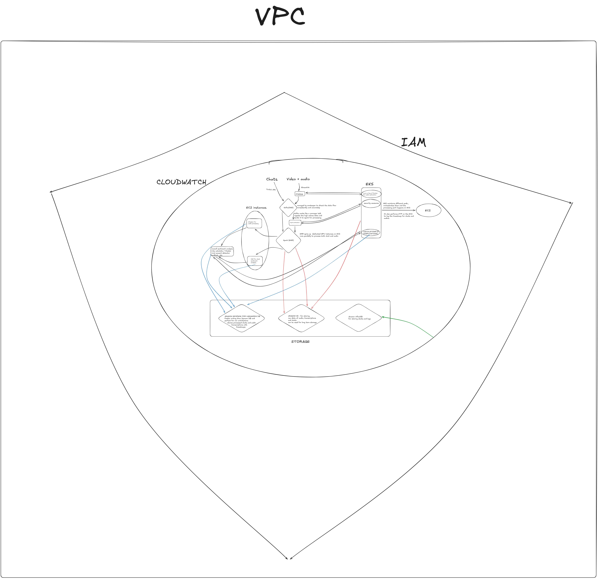

# StreamVibe 🎮

> Real-time Twitch stream intelligence — detect viral moments, analyze chat sentiment, and transcribe audio before the clip ends.

**Status:** Prototype complete · Architecture documented · Code not public (licensing)

---

## What It Does

StreamVibe monitors a live Twitch stream and answers one question in near real-time: *is this moment about to go viral?*

It does this by fusing two signals simultaneously:

- **Chat momentum** — how fast is chat moving, what emotes are flying, what's the sentiment vector
- **Audio energy** — what's the streamer actually saying right now, and is their voice spiking

When both spike at the same time, StreamVibe flags a **Viral Moment** — a 15-second clip with a measurable higher probability of performing on TikTok/Shorts.

---

## Architecture



The system is built around a **"Muscle vs. Brain"** philosophy:

| Layer | Component | Role |
|---|---|---|
| **Muscle** | Kafka + Spark + Cassandra | Infrastructure — ingest the firehose without dropping data |
| **Brain** | CNN + Lexica + Whisper | Intelligence — turn cryptic emotes and speech into sentiment vectors |
| **Orchestrator** | Python async engine | Fuse both signals, detect viral moments, enforce safety |

### Full Stack

```
Twitch IRC ──────────────────► Kafka (MSK) ──► Spark (EMR) ──► Cassandra / S3
                                                     │
Twitch Stream ──► Streamlink ──► FFmpeg ──► Whisper ASR ──► Spark ──► InfluxDB
                                                     │
                                            Viral Moment Detector
                                            Sentiment Brain (CNN)
                                            RaidLock Safety Gate
                                                     │
                                            Streamlit Dashboard
```

**AWS Services:** VPC · EKS · EC2 (GPU g4dn.xlarge) · EMR · MSK · S3 · Amazon Keyspace (Cassandra) · InfluxDB · CloudWatch · IAM

**Local / Docker:** Kafka · ZooKeeper · Spark · Redis · InfluxDB · Grafana

---

## Core Features

### 1. Viral Moment Indexer
Correlates chat momentum spikes with audio energy spikes. Flags 15-second windows where both signals exceed thresholds simultaneously — these clips are statistically more likely to perform on short-form video platforms.

### 2. RaidLock Safety Gate
Blocks automated raid recommendations when unsafe conditions are detected:
- `PHYSICAL_RAGE` — audio energy above threshold (streamer is tilting)
- `STUNNED_SILENCE` — chat MPS > 50 but audio drops to near-zero (crowd stunned, streamer silent)

Race conditions in safety checks are handled with atomic `RaidSafetyLock` (threading.RLock).

### 3. Emote Sentiment Brain
Twitch chat is not English. "KEKW", "PauseChamp", "COPIUM" carry precise emotional signals that standard NLP fails on completely. The Brain uses a CNN-based classifier trained on Twitch-specific lexica (emote distribution + VADER weighted) to convert emote-heavy messages into sentiment vectors: `{positive, negative, neutral, hype, toxic}`.

### 4. ZenMode (Toxic Cluster Detection)
Monitors for "Toxic Sentiment Clusters" — sustained negative sentiment that correlates with streamer burnout. Surfaces nudges to the streamer before it compounds.

---

## Repository Structure

```
streamvibe/
├── diagrams/
│   └── ARCHITECTURE.png          # Full AWS + data flow diagram
├── docs/
│   └── adr/
│       ├── ADR-001-kafka-over-kinesis.md
│       ├── ADR-002-cassandra-keyspace.md
│       ├── ADR-003-whisper-asr.md
│       ├── ADR-004-cnn-emote-brain.md
│       ├── ADR-005-singleton-pattern.md
│       ├── ADR-006-raidlock-safety.md
│       └── ADR-007-ffmpeg-over-streamlink-direct.md
└── README.md
```

Source code is not included in this repository due to licensing constraints on integrated third-party components ([emote-controlled](https://github.com/emote-controlled/emote-controlled), [twitch-chat-insight](https://github.com/twitch-chat-insight)).

---

## Architecture Decisions

See [`docs/adr/`](./docs/adr/) for the full decision log. Key decisions:

| ADR | What | Why |
|---|---|---|
| [001](./docs/adr/ADR-001-kafka-over-kinesis.md) | Kafka (MSK) not Kinesis | Consumer group model, Spark connector maturity, replay |
| [002](./docs/adr/ADR-002-cassandra-keyspace.md) | Cassandra not DynamoDB | Write throughput, timestamp-keyed access patterns |
| [003](./docs/adr/ADR-003-whisper-asr.md) | Whisper not cloud ASR | Latency, cost at scale, offline inference on GPU |
| [004](./docs/adr/ADR-004-cnn-emote-brain.md) | CNN + lexica not VADER alone | Twitch emotes break standard NLP entirely |
| [005](./docs/adr/ADR-005-singleton-pattern.md) | Singleton for ML components | GPU VRAM is finite — one Whisper instance, period |
| [006](./docs/adr/ADR-006-raidlock-safety.md) | RaidLock as a hard gate | Brand safety requires a non-bypassable circuit breaker |
| [007](./docs/adr/ADR-007-ffmpeg-over-streamlink-direct.md) | FFmpeg pipeline not direct Streamlink | 60% CPU reduction, cleaner audio frames for VAD |

---

## Design Patterns Used

**Singleton** — `SingletonMeta` metaclass applied to all heavy ML components (`INT8QuantizedSentimentAnalyzer`, `LiveAudioTranscriptionEngine`, `ViralMomentDetector`). Prevents duplicate GPU model loads. ~75% VRAM reduction vs. naive instantiation.

**Factory** — `StreamVibeFactory` centralizes component creation with config injection. Decouples instantiation from business logic.

**Async Event Loop** — `AsyncEventLoop` class replaces blocking `time.sleep()` calls throughout the pipeline. Zero blocking operations in the hot path.

**Circuit Breaker** — `CircuitBreaker` pattern on the Twitch IRC connection and Kafka producer. Detects botnet-style message floods and opens the circuit before they saturate the queue.

---

## Cost Estimate (1 stream, AWS)

| Service | Config | Monthly |
|---|---|---|
| EC2 g4dn.xlarge (GPU) | 16GB RAM, NVIDIA T4 | ~$379 |
| EC2 general purpose | 16GB RAM | ~$35 |
| MSK (Kafka) | Managed cluster | ~$58 |
| EKS | Control plane | ~$73 |
| Amazon Keyspace | Serverless | ~$0.05 |
| S3 | 100 GB | ~$10 |
| InfluxDB | Managed | ~$10 |
| **Total** | | **~$1,230/mo** |

Spot instances + Reserved capacity can reduce this 40–70%.

---

## What Was Actually Built (Prototype Scope)

- Live IRC ingestion from Twitch (1–3 channels)
- Streamlink → FFmpeg → WebRTC VAD → Whisper ASR pipeline
- CNN-based emote sentiment scoring (INT8 quantized for RTX 4060)
- Viral moment detection with cosine similarity vibe clustering
- RaidLock safety gate with thread-safe atomic state
- Streamlit real-time dashboard
- Docker Compose local stack (Kafka + Spark + Redis + InfluxDB + Grafana)
- Tested against live streams: `Jynxzi`, `zackrawrr`

---

## Third-Party Components

This prototype integrates two open-source projects as its core subsystems:

- **[emote-controlled](https://github.com/emote-controlled/emote-controlled)** — CNN-based Twitch emote sentiment classifier (The Brain)
- **[twitch-chat-insight](https://github.com/twitch-chat-insight)** — Kafka + Spark + Cassandra IRC ingestion pipeline (The Muscle)
